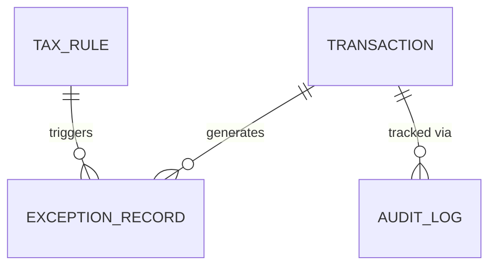

# Tax Gap Detection & Compliance Validation Service

## Overview
A backend service built with Spring Boot 3 and Java 17 that audits financial transactions, calculates tax gaps, and runs dynamic, database-driven compliance rules.

## Architecture
- **Layered Design**: Controller -> Service -> Repository.
- **Rule Engine**: Evaluates JSON-configured rules stored in the database dynamically.
- **Audit Logging**: Asynchronous logging of Ingestion, Tax Computation, and Rule Execution.

## Tech Stack
- Java 17, Spring Boot 3, Spring Security
- Spring Data JPA
- **Database:** MySQL 8 (Real SQL DB, utilizing native JSON columns)
- JUnit 5 & Mockito (Coverage: >50%)

## How to Run
1. Clone the repository: `git clone [URL]`
2. Ensure Maven and Java 17 are installed.
3. Run: `mvn spring-boot:run`

## How It Works (Design & Architecture)

This project uses a standard **Layered Monolithic Architecture** (Controller -> Service -> Repository) to keep concerns separated and the code easy to test. 

Here is the data flow:
1. **Ingestion:** The `TransactionController` receives a JSON batch of transactions.
2. **Tax Math:** The `TaxEngineService` calculates the difference between `expectedTax` and `reportedTax` to find the gap, marking the transaction as COMPLIANT, UNDERPAID, or OVERPAID.
3. **Dynamic Rule Engine:** Instead of hardcoding rules in Java, business rules (like "flag transactions over $10k") are stored in the database. The `RuleEngineService` fetches active rules, parses their configuration, and evaluates the transaction. Failures generate an `ExceptionRecord`.
4. **Audit Trail:** An `AuditService` logs every step (Ingestion, Computation, Rule Execution) to ensure strict traceability.

## Database Schema

Since we are using H2, the dynamic rule configurations and audit details are stored as strings. Hibernate automatically generates these tables on startup.



    TRANSACTION {
        VARCHAR(255) transaction_id PK
        DATE date
        VARCHAR(255) customer_id
        DECIMAL amount
        DECIMAL tax_rate
        DECIMAL reported_tax
        VARCHAR(50) transaction_type
        DECIMAL expected_tax
        DECIMAL tax_gap
        VARCHAR(50) compliance_status
    }

    TAX_RULE {
        BIGINT id PK
        VARCHAR(255) rule_name
        BOOLEAN is_active
        VARCHAR(4000) configuration "Stores JSON string"
    }

    EXCEPTION_RECORD {
        BIGINT id PK
        VARCHAR(255) transaction_id FK
        VARCHAR(255) customer_id
        VARCHAR(255) rule_name
        VARCHAR(50) severity
        VARCHAR(500) message
        TIMESTAMP timestamp
    }

    AUDIT_LOG {
        BIGINT id PK
        VARCHAR(255) transaction_id FK
        VARCHAR(50) event_type
        VARCHAR(4000) detail_json "Stores JSON string"
        TIMESTAMP timestamp
    }


## Database Setup
The application uses Hibernate to automatically generate the schema (`spring.jpa.hibernate.ddl-auto=update`). 
Pre-filled User data and Rule configurations are loaded via `src/main/resources/data.sql`.

## Sample Postman Call (Upload Transactions)
**POST** `http://localhost:8080/api/v1/transactions/upload`
**Auth**: Basic Auth (user: admin, pass: password)
**Body**:
```json
[
  {
    "transactionId": "TXN-1001",
    "date": "2023-10-01",
    "customerId": "CUST-55",
    "amount": 15000.00,
    "taxRate": 0.10,
    "reportedTax": 1400.00,
    "transactionType": "SALE"
  }
]
